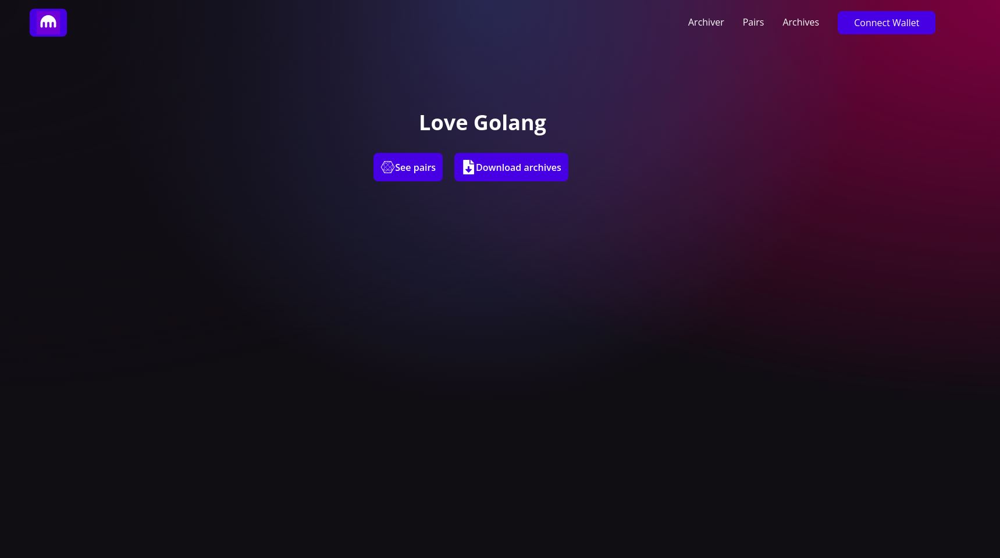
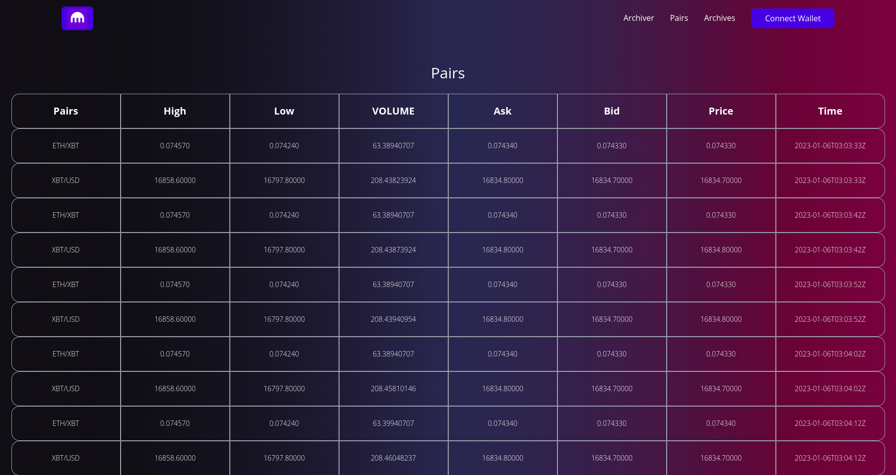
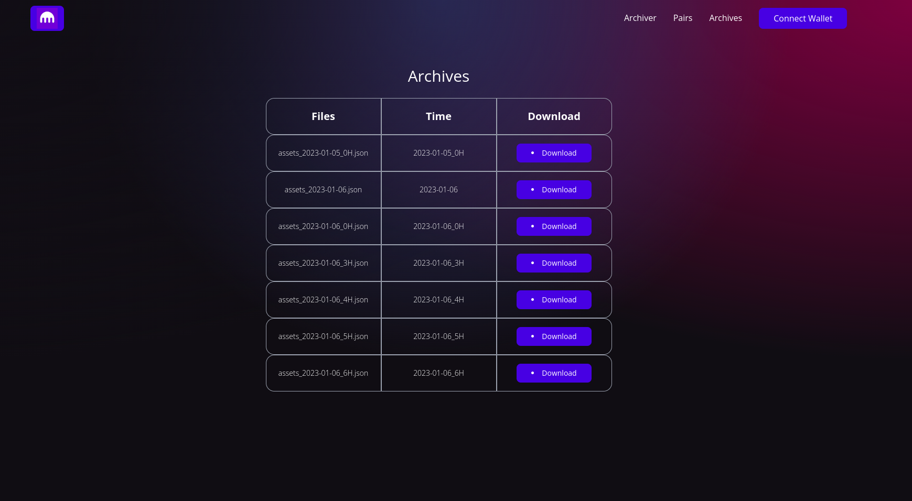

Kraken Bot Project

## Files

constants.go : Tous les variables d'environnement
api.go : les functions de requête vers l'api
dabase.go : Connection à la base de donnée , insertion de données et récupération de ces données
files.go : Insertion des données dans un fichier dans le directory Archive
main.go : appel global
server.go : les fonction des routes pour récupérer les données de la bd, les fichiers, et leur téléchargement.
structs.go : tous les structures
utils.go : pour les fonctions utiles

## Fonctionnalité

### Backend

- Requête vers l’API Kraken pour récupérer:
    - le statut et timing du serveur,
    - les paires de trading,
    - les informations relatives à chaque paire de trading.
- Mise en forme des données et archive dans un dossier nommé
Archive
- Écriture des données sur une BDD Postgres avec le bon format.
- une route API pour télécharger un fichier nommé par heure.
- Une route API pour visualiser les informations dans la BDD via une page web.

## Front 

- Accueil

- Visualisation des datas 

- Telechargement d'un archive par heure

